# Description

This is a personal commandline tool for fixing subtle distortion present in some animated gifs recorded from emulator gameplay. For a detailed explanation of its motivation and function, please see below.

|                     |                                      Input                                      |                                  Output                                 |
|---------------------|:-------------------------------------------------------------------------------:|:-----------------------------------------------------------------------:|
| Trivial Example     |           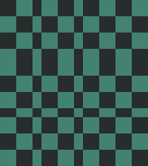           |         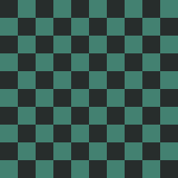        |
| Toy Example         |             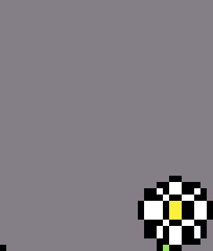            |          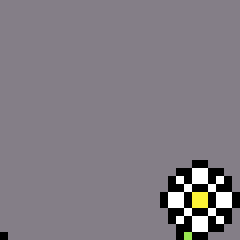          |
| Exaggerated Example |  | 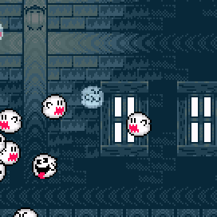 |
| Subtle Real Example |     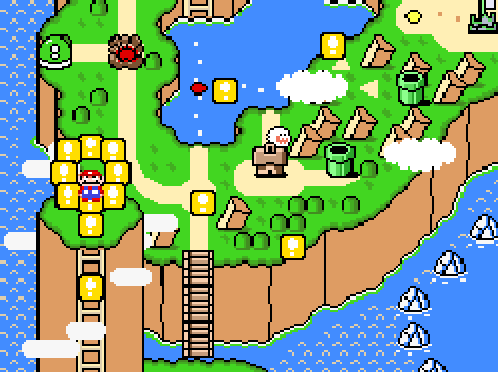     |     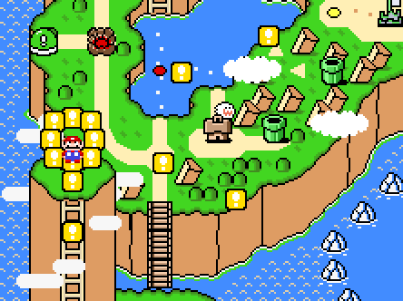    |

# Motivation & Use Cases

Suppose someone emulates a sprite-based game, such as Super Mario World (SNES, 1990). For ease of illustration, let's pretend that the game in question has an internal, native resolution of 40 pixels wide by 30 pixels tall, so that this is an entire frame of gameplay:


This is a very small image. The player likely wants to see the game at a higher resolution. If they go into the emulator's settings and select an integer zoom level, e.g. “12x” or “1200% Zoom”, then there's no question of what the emulator should display: every pixel in the original frame corresponds to a 12-by-12 "block" of pixels, with the same color as the original pixel, in the newly-resized game window, resulting in a game window exactly 12 times as wide and 12 times as tall as the game's internal resolution. This is also the result if the player manually enters 480x360 pixels as the emulator's output resolution.


Instead, suppose our player enters an output resolution that's _not_ a nice integer multiple of 40x30. How should the emulator upscale from the original 40x30 image to something that's not exactly 80x60, 160x120, etc.? What if the player drags around the corner of the emulator window, resizing it arbitrarily, possibly even to a resolution that's not even 4:3 in aspect ratio?

In that case, the emulator can't just scale up every native-resolution pixel to be a solid 12x12 (or 2x2, 3x3, etc.) block of pixels like before, so it instead has to do one of two things:

(1) stretch the output image in a way that blurs pixels together, or

(2) make some of the rows and columns of pixel-blocks be larger or smaller than the rest, resulting in an uneven grid of pixel-blocks

If our user has dragged the corner of the emulator window to a size of 86x54 pixels—a little shorter and wider than the integer multiple 80x60—and the emulator uses strategy (2), the resized frame is displayed as follows:

|                Displayed frame (86x54)               |                 (Same frame zoomed in for convenience)                 |
|:----------------------------------------------------:|:----------------------------------------------------------------------:|
| 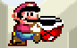 |  |

This is a disaster. Most of the columns are 2 pixels wide, but some are 3 pixels wide (notably, one of Mario's pupils is erroneously wider than the other.)  Similarly, most of the rows are 2 pixels tall, but some are only 1 pixel tall. The grid of "blocks" isn't a checkerboard of even squares, but instead consists of rectangular blocks with dimensions of either 2x2, 3x2, 2x1, or 3x1, depending on the particular row or column:

|                 Displayed frame (zoomed for convenience)                 |                      Displayed frame with grid overlaid                     | Grid by itself                                      |
|:------------------------------------------------------------------------:|:---------------------------------------------------------------------------:|-----------------------------------------------------|
|  | 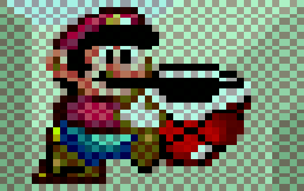 | 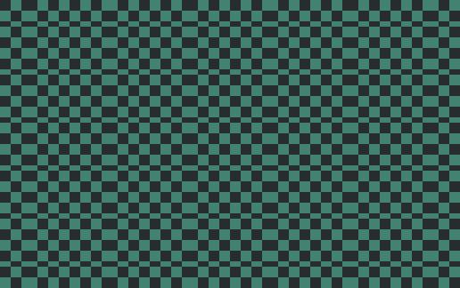 |


If our player takes screenshots or records gifs under these conditions, the resulting images will be distorted as above.

Finally, **fix-pixel-grid** comes into play. This tool attempts to fix gifs (or still images) recorded from emulation under condition (2), outputting its best guess at what the recorded gif _would have been_ had the display size been an integer multiple of the native resolution. It does this using only the gif itself, with no other information available, and the gif possibly having been cropped (it is not assumed that an input gif shows the full game window.)

Here's our distorted frame before and after running through **fix-pixel-grid**:

|                                             |                                    Input                                    |                                                                               Output                                                                              |
|---------------------------------------------|:---------------------------------------------------------------------------:|:-----------------------------------------------------------------------------------------------------------------------------------------------------------------:|
| Displayed frame                             |                      |                                                           |
| Displayed frame with grid overlaid          |     | 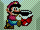                             |
| Displayed frame (zoomed)                    |     |                                  |
| Displayed frame with grid overlaid (zoomed) |  |  |

The outputs of the tool match how the frame _would_ have been displayed at the resolution 80x60 (at exactly double the native resolution.)

This specific form of distortion sometimes shows up in video game gifs floating around online, and I figured most such images could be fixed automatically. I very highly doubt anyone else will ever use this, but you never know! :)

# Installation

Clone the repo, open a terminal in the top-level directory, create a virtual environment, and install the requirements:
```
python3 -m venv env
source env/bin/activate
pip3 install -r requirements.txt
```

# Usage
```
fix.py [-h] [--out OUTPUT_DIRECTORY]
       [--force-square | --force-scale HEIGHT [WIDTH]]
       paths [paths ...]
```

- `--out` -- specify an output directory. Otherwise, outputs will be written to `./out` by default

- `--force-square` -- specifies that the vertical and horizontal scale are the same: the blocks must be as tall as they are wide. (This is not always true, e.g. _Sonic the Hedgehog (8-bit)_ on Game Gear has "pixels" that are 3:2 in aspect.) Otherwise, the tool will not assume that the hoizontal and vertical axes have the same scale

- `--force-scale` -- convenience option specifying a size for the pixel blocks other than the one apparent in the input. E.g. on an input where most blocks are 2 pixels tall and 2 pixels wide, `--force-scale 4` will attempt to recreate the gif as if it had been recorded at x4 the native resolution, instead of at x2

- `paths` -- path(s) to input images. If a path to a directory is given, all images in that directory will be processed